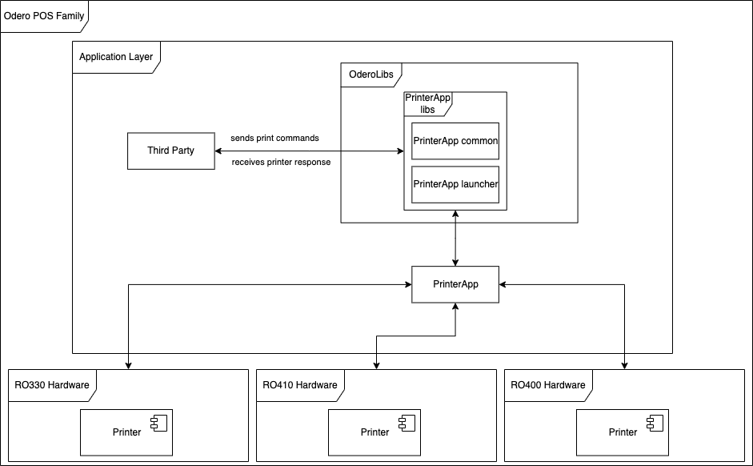

## Launcher 
In order to be recognized by Token Platform and be visible in the Launcher, please add the following fields to `AndroidManifest.xml` file.

> AndroidManifest.xml

```xml
<application>
    <!-- Other fields -->
    <!-- App Name should be started with LYL, thus Launcher can differentiate sale apps -->
    <meta-data android:name="app_name" android:value="LYL_APP_NAME" />
    <meta-data android:name="app_model_type" android:value="400TR" />
    <meta-data android:name="app_version" android:value="1" />
    <meta-data android:name="sale_activity_name" android:value="<internal_packages>.<activity_name>" />
</application>
```

Please ensure that `sale_activity_name` is the Activity that will be shown to the customers as the first screen.

```xml
<activity android:name=".activity.MyActivity"
            android:exported="true"></activity>
<!-- Example Usage -->
    <meta-data android:name="sale_activity_name" android:value=".android.MyActivity" />
```

## PaymentGateway

Allows payment requests in a uniform way across all POS family.

The API is agnostic of the underlying payment procedures, which may involve banking, card reading, etc.

The PGW will take care of all the printing during a payment request. The caller does not need to handle it via the printer app.

](../images/317915137.png)

### Setup 
In order to access the PGW app, the following pgw-launcher and common library should be included in the app. To do this add the following maven url to `settings.gradle` under dependencyResolutionManagement/repositories:

> settings.gradle

```gradle
maven {
    url 'https://ro-artifactory.devtokeninc.com/artifactory/PublicLibraries/'
}
```

And also in `app/build.gradle` the actual dependency should be added: `implementation 'PaymentGateway:pgw-launcher:1.0.3'`

> build.gradle

```gradle
dependencies {
implementation 'PaymentGateway:pgw-launcher:1.0.3'
}
```

- the pgw-launcher should also add the common lib, if not please add the dependency `implementation ('PaymentGateway:common:1.0.3')`

### Request payment

The payment request is done via an ActivityResultLauncher contract.

> Obtaining the PGW contract

```kotlin
val paymentResultContract = PGWLauncher.getPGWContract(context)
```
> Returns null if the PGW app is not installed on the device.


> Payment request

```kotlin
import ro.odero.paymentgateway.common.data.CurrencyCode
import ro.odero.paymentgateway.common.data.PaymentOption
import ro.odero.paymentgateway.common.data.request.PaymentRequest
import ro.odero.paymentgateway.launcher.PGWLauncher

val pgwContract = PGWLauncher.getPGWContract(context)

if (pgwContract == null) {
       
}

val paymentLauncher = registerForActivityResult(pgwContract) {
paymentResponse : PaymentResponse ->
//payment response
}

paymentLauncher.launch(PaymentRequest(
                amount = 12345,
                paymentOptions = listOf(PaymentOption.Card),
                currencyCode = CurrencyCode.RON
            ))
```

According to the selected payment options PGW will handle the payment and printing. The amount will be internally translated as amount/100 to cover the currency decimal; in this case 12345 will internally converted to 123,45

### Handling PaymentResponse
Check the PaymentResponse based on the payment options sent.

> PaymentResponse handling

```kotlin
paymentResponse : PaymentResponse ->

if(paymentResponse is CardPaymentResponse)...

if(paymentResponse is CashPaymentResponse)...

```

> Types of PaymentResponse

```kotlin
sealed class CardPaymentResponse : PaymentResponse {

    data class Success(
        val receiptNumber: String,
        val bankActivityResultCode: Int,
        val bankStatus: Int,
        val customerSlip: String,
        val merchantSlip: String,
    ) : CardPaymentResponse()

    data class Fail(
        val receiptNumber: String,
        val bankActivityResultCode: Int,
        val bankStatus: Int,
        val message: String,
    ) : CardPaymentResponse()
}


sealed class CashPaymentResponse : PaymentResponse {

    data class Success(
        val receiptNumber: String,
    ) : CashPaymentResponse()

    data class Fail(
        val receiptNumber: String,
        val message: String,
    ) : CashPaymentResponse()
}
```

## Printer App

Allows printing in a uniform way across all POS family.

The API is agnostic of the underlying hardware but provides a set of well defined PrintCommands.



### Setup

In order to access the Printer App, the following `printer-launcher` and `common` library should be included in the app. To do this add the following code into `settings.gradle` under dependencyResolutionManagement/repositories:

> settings.gradle

```gradle
maven {
    url 'https://ro-artifactory.devtokeninc.com/artifactory/PublicLibraries/'
}
```

Add in `build.gradle` the lib dependencies: `implementation 'PrinterApp:printer-launcher:1.0.3'`
 (the pgw-launcher should also add the common lib, if not please add the dependency `implementation 'PrinterApp:common:1.0.3'`)


> build.gradle

```gradle
dependencies{
    implementation 'PrinterApp:printer-launcher:1.0.3'
}
```

### Printing

There are two distinct flows that have to be implemented

- Checking if printer is ready to print
  - The check includes also if paper is present

> When printer is ready print the receipts

```kotlin
val printerErrorCheck = registerForActivityResul(PrinterHealthResultContract()){
printerHealth: PrinterHealthResponse? ->

if(printerHealth.hasErrors.not()){
printReceipts()
}else
{
    //treat the error
}

}


```

- Actual printing

> Actual printing contract that is used to start the PrinterApp

```kotlin
val printerLauncher = registerForActivityResult(PrinterResultContract()) {
printerResponse: PrinterResponse? ->
//treat printer response
}
```

> Receipts example

```kotlin
 val customerReceipt = listOf(
        PrintCommand.PrintSpace,
        PrintCommand.PrintImage(image), PrintCommand.PrintSpace,
        PrintCommand.PrintWithBold(true),
        PrintCommand.PrintText(
            "Test SRL",
            TextAlignment.Left,
        ),
        PrintCommand.PrintWithBold(false),
        PrintCommand.PrintSpace,
        PrintCommand.PrintText(
            "Data:10.03.2023",
            TextAlignment.Left,
        ),
        PrintCommand.PrintText(
            "Ora:10:00",
            TextAlignment.Right,
        ),
        PrintCommand.PrintText(
            "TID:0 MID:0",
            TextAlignment.Left,
        ),
        PrintCommand.PrintSpace,
        PrintCommand.PrintSpace,
        PrintCommand.PrintText(
            "AID:00000",
            TextAlignment.Right,
        ),
        PrintCommand.PrintText(
            "0000000000",
            TextAlignment.Left,
        ),
        PrintCommand.PrintFontSize(FontSize.Small),
        PrintCommand.PrintColumns(arrayOf("BATCH:000001", "BON:000001")),
        PrintCommand.PrintColumns(arrayOf("RRN:00123456789", "RC: 00")),
        PrintCommand.PrintColumns(arrayOf("AUTH:775040", "STAN:012345")),
        PrintCommand.PrintLine, PrintCommand.PrintWithBold(true),
        PrintCommand.PrintFontSize(FontSize.Large),
        PrintCommand.PrintColumns(arrayOf("SUMA:", "50")),
        PrintCommand.PrintWithBold(false), PrintCommand.PrintSpace,
        PrintCommand.PrintText("APPROVED", TextAlignment.Left),
        PrintCommand.PrintFontSize(FontSize.Medium),
        PrintCommand.PrintText("EXEMPLAR CLIENT", TextAlignment.Left),
        PrintCommand.PrintLine, PrintCommand.PrintSpace,
        PrintCommand.PrintSpace,
    )

    val merchantReceipt = listOf(
        PrintCommand.PrintSpace,
        PrintCommand.PrintImage(image), PrintCommand.PrintSpace,
        PrintCommand.PrintWithBold(true),
        PrintCommand.PrintText(
            "Test SRL",
            TextAlignment.Left,
        ),
        PrintCommand.PrintWithBold(false),
        PrintCommand.PrintSpace,
        PrintCommand.PrintText(
            "Data:10.03.2023",
            TextAlignment.Left,
        ),
        PrintCommand.PrintText(
            "Ora:10:00",
            TextAlignment.Right,
        ),
        PrintCommand.PrintText(
            "TID:0 MID:0",
            TextAlignment.Center,
        ),
        PrintCommand.PrintSpace,
        PrintCommand.PrintSpace,
        PrintCommand.PrintText(
            "AID:00000",
            TextAlignment.Right,
        ),
        PrintCommand.PrintText(
            "0000000000", // cardno
            TextAlignment.Left,
        ),
        PrintCommand.PrintFontSize(FontSize.Small),
        PrintCommand.PrintColumns(arrayOf("BATCH:000001", "BON:000001")),
        PrintCommand.PrintColumns(arrayOf("RRN:00123456789", "RC: 00")),
        PrintCommand.PrintColumns(arrayOf("AUTH:775040", "STAN:012345")),
        PrintCommand.PrintLine, PrintCommand.PrintWithBold(true),
        PrintCommand.PrintFontSize(FontSize.Large),
        PrintCommand.PrintColumns(arrayOf("SUMA:", "50")),
        PrintCommand.PrintWithBold(false), PrintCommand.PrintSpace,
        PrintCommand.PrintText("APPROVED", TextAlignment.Left),
        PrintCommand.PrintFontSize(FontSize.Medium),
        PrintCommand.PrintText("EXEMPLAR VANZATOR", TextAlignment.Center),
        PrintCommand.PrintLine, PrintCommand.PrintSpace,
        PrintCommand.PrintSpace,
    )
```

> Printing

```kotlin
fun printReceipts(){

printerLauncher.launch(
            PrinterRequest(
                listOf(
                    PrintDocument(
                        clientReceipt,
                        "Chitanta client",
                    ),
                    PrintDocument(merchantReceipt, "Chitanta vanzator"),
                ),
                PrintRequestType.PrintWithDialog, // will show a dialog between each print
                // document
                // PrintRequestType.SimplePrint //will print each document back-to-back - useful
                // for setlements, reports, etc
            )),
}

```

> PrinterResponse structure

```kotlin
data class PrinterResponse(
    val status: Status,
    val message: String,
    val data: List<DocumentData>,
) {

    enum class Status {
        SUCCESS,
        ERROR,
    }
}
```